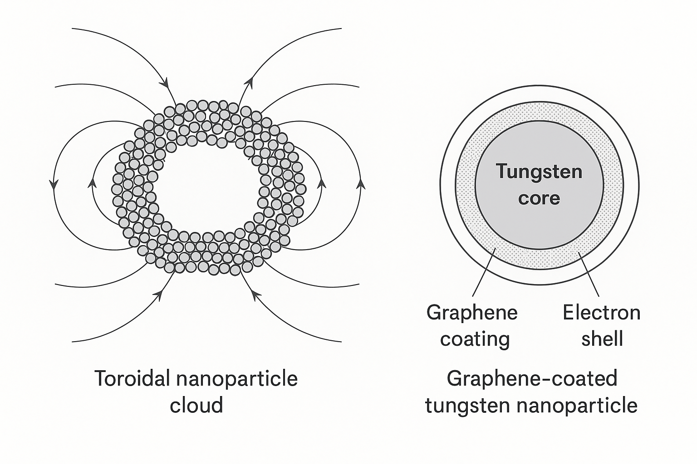
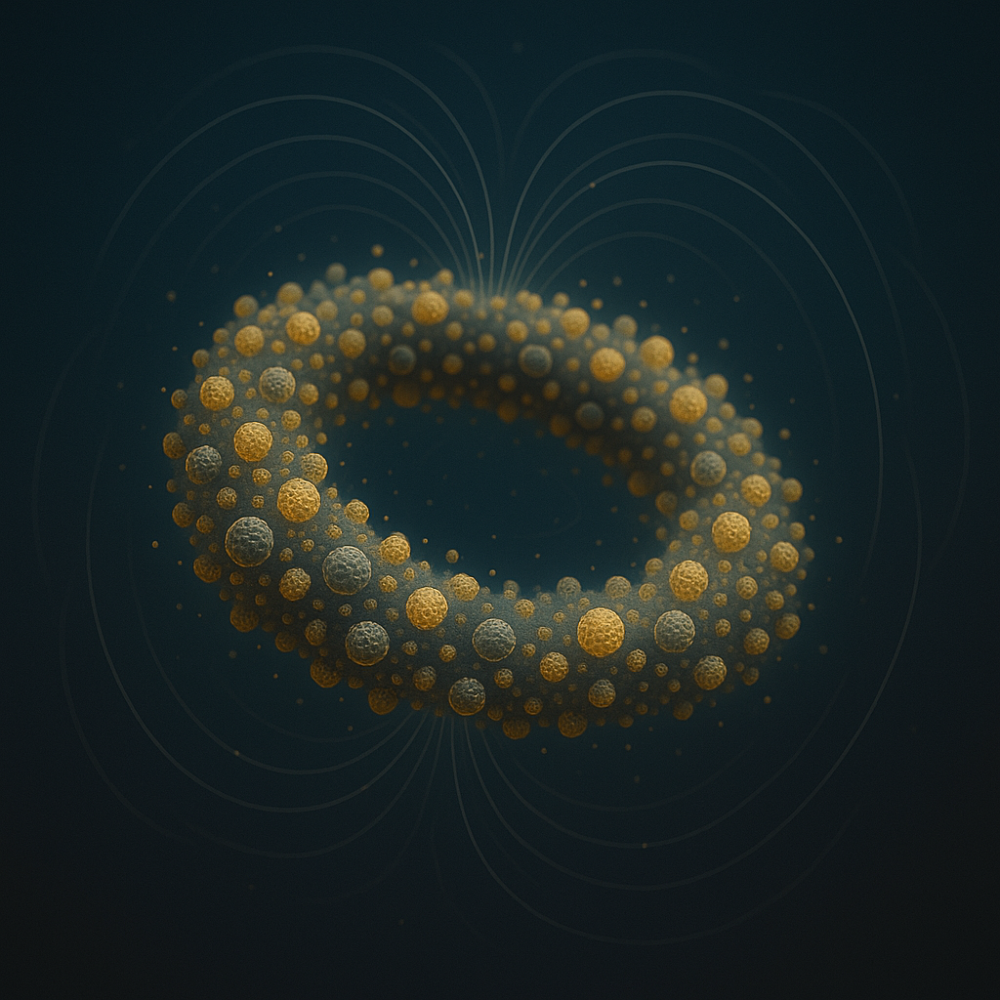

# Toroid and Nanoparticle Models for Quantum-Gravitational Resonance

This repository presents a theoretical framework for achieving quantum–gravitational resonance through engineered symmetry between the de Broglie wavelength and the Schwarzschild radius:
$\lambda = R_s$

While this relationship naturally arises only at the Planck scale — and in a single object under extreme relativistic conditions — we propose a **two-subsystem approach** to realize it in laboratory-accessible systems.

## Core Idea

The resonance condition is constructed between two physical subsystems:

* A **mass subsystem** (tungsten), providing most of the gravitational mass:
  $R_s = \frac{2GM}{c^2}$
* A **wave subsystem** (graphene electrons), providing mobile quantum waves:
  $\lambda = \frac{h}{mv}$

By tuning electron velocities or using relativistic drift, one can match the effective wave to the mass’s Schwarzschild radius.

## Investigated Configurations

1. **Graphene-coated tungsten toroid**
2. **Dense cloud of graphene-coated tungsten nanoparticles**

These hybrid systems allow the de Broglie wavelength to approach the Schwarzschild radius at:
$\lambda = R_s \approx 10^{-25} \, \text{m}$

## Visual Illustration

  
*Fig. 1 — Graphene-coated tungsten toroid configuration achieving λ = Rₛ symmetry.*

  
*Fig. 2 — Dense graphene–tungsten nanoparticle cloud designed to produce resonance at ~10⁻²⁵ m.*

  
*Fig. 2 — Magnetic fields form a rotating nanoparticle cloud toroid increasing the likelyhood of resonance at ~10⁻²⁵ m.*

These images show the coupling between mass and wave subsystems in a structured configuration, enabling a symmetry not accessible in standard particles.

---

## Motivation

* Explore possible access to quantum–gravitational interaction without new particles or speculative physics.
* Inspire new directions in experimental setups involving **structured mass–wave systems**.
* Open a route toward speculative applications in **resonant energy systems**, **propulsion concepts**, and **black hole analogs**.

## Licensing and Citation

* **Author**: *Gravity Resonance* (pseudonym)
* **DOI**: [10.5281/zenodo.16371538](https://doi.org/10.5281/zenodo.16371538)
* **License**: [CC-BY-NC 4.0](https://creativecommons.org/licenses/by-nc/4.0/)

> Recognition is requested in both scientific and technological applications. A seat on the maiden voyage is optional — but appreciated 😉


* **Author and Contact**:
This project is published under the pseudonym Gravity Resonance to preserve privacy from general internet indexing.

For serious scientific inquiries, collaboration proposals, or formal agreements (including commercial or research use), the author is willing to disclose identity under mutual confidentiality and signed agreement. Please use Zenodo's private messaging or GitHub Discussions to initiate contact.


## Topics

```text
quantum-gravity, de-broglie, schwarzschild-radius, toroid, resonance,
graphene, nanoparticles, black-hole-physics, relativity, planck-scale,
gravity, quantum-mechanics, quantum-field-theory, fundamental-physics,
high-energy-physics, experimental-physics, wave-particle-duality,
quantum-wave, de-broglie-wavelength, tungsten
```

## Companion Resources

* [Zenodo Record](https://zenodo.org/record/16371538)
* OSF Archive (linked in Zenodo description)

---
> *This is both a scientific and philosophical call to honor the origin of ideas.*
