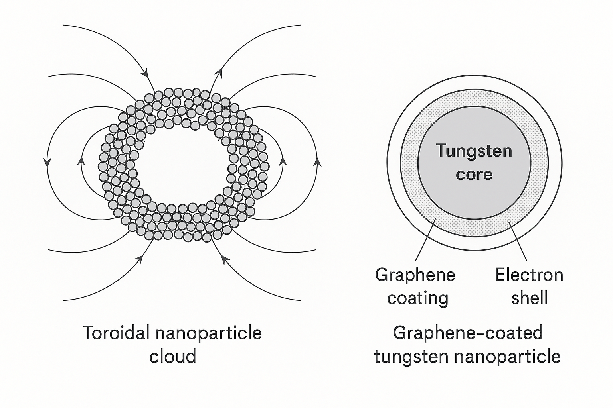
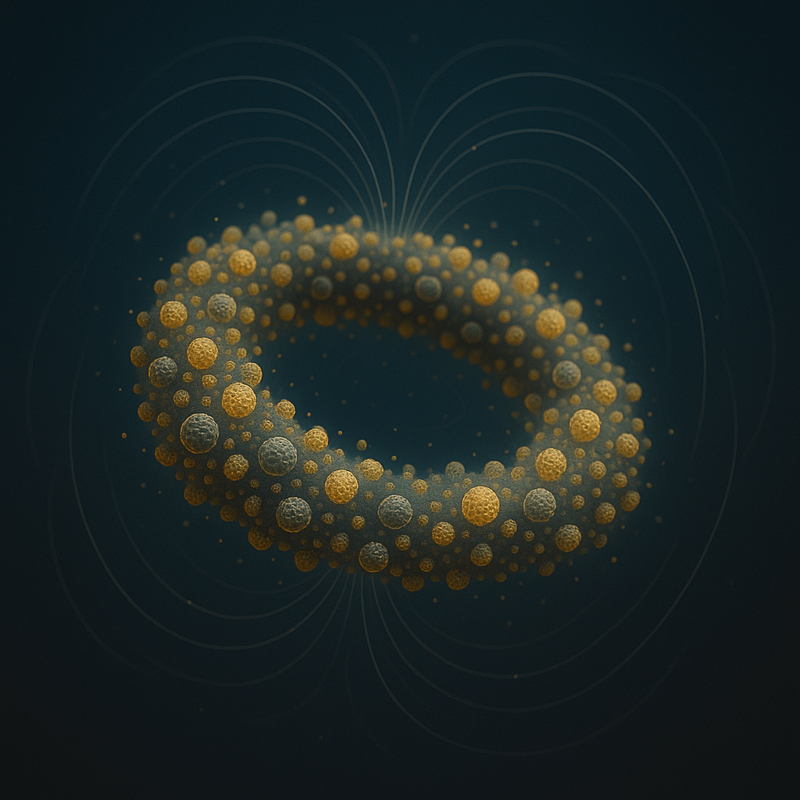

# Quantum Vacuum Granule Framework — (A-Series, A1–A9)


Description:
Nine interconnected theoretical papers on quantum gravity and vacuum structure, published 2025–2026,"Gravity Resonance". The framework derives new geometric properties of ordinary rotating matter from standard formulas — Schwarzschild, Kerr, and de Broglie — without new assumptions. Key results include: the de Broglie–Schwarzschild borderline equality λ = Rₛ; the imaginary Kerr horizon in every common rotating body; the Mass Cancellation Theorem; a vacuum granule mass range of 10⁻⁵⁰ to 10⁻⁴³ kg derived from the empirical 1–5 Hz noise floor; and nanoparticle resonator arrays for vacuum sensing and advanced propulsion. Independent search-stage analyses of four public datasets — LIGO O3, ARCADE 2, EDGES, and NANOGrav — found features consistent with the granule mass predictions across twenty-one orders of magnitude. AI assessment documents are included alongside the primary papers. Primary publications with DOIs: https://zenodo.org/records/18888582

The full A-series of 9 articles is available here https://zenodo.org/records/18888582

A1b — Toroid Models for Quantum-Gravitational Resonance via de Broglie–Schwarzschild Symmetry DOI: https://doi.org/10.5281/zenodo.16449277

A2 — Soft-Matter Toroid for Quantum–Gravitational Resonance: Toward a Tabletop Realization of de Broglie–Schwarzschild Symmetry DOI: https://doi.org/10.5281/zenodo.17541112

A3 — De Broglie–Kerr Ergosphere Resonance in Rotating Coherent Systems: Listening to the Horizon DOI: https://doi.org/10.5281/zenodo.17594467

A4 — Imaginary Kerr Horizon in Every Rotating Body Below One Solar Mass: A Universal Quantum-Gravity Boundary DOI: https://doi.org/10.5281/zenodo.17619734

A5 — Quantum-Gravitational Double-Resonance Propulsion Rings: Spacecraft-Scale Architecture and Physical Basis DOI: https://doi.org/10.5281/zenodo.17634226

A6 — Hybrid van der Waals Graphene–Hydrogel–Mass-Seed Resonator for Asymmetric Mechanical Response and Electromechanical Output DOI: https://doi.org/10.5281/zenodo.17684823

A7 (Version 2)— Imaginary Kerr Horizons in Ordinary Rotating Matter: A New Geometric Property and Its Possible Connection to the Universal 1–5 Hz Signal DOI: https://doi.org/10.5281/zenodo.19320019

A8 (Version 2) — Kerr Geometry and the Angular-Duality Wavelength: Mass Cancellation and Borderline Resonance from Nanoparticle to Galaxy https://doi.org/10.5281/zenodo.19275058

A9: The Quantum Vacuum Granule: Three Complementary Mass Scales from the 1--5 Hz Universal Hum https://doi.org/10.5281/zenodo.18888582

The earlier papers (A1–A6) explore possible engineered resonance systems, while A7–A9 focus on deriving mass and geometric scales from observed phenomena and standard equations.


Description of A1 (for the rest of papers, please click on the links above)

This repository presents a theoretical framework for achieving **quantum–gravitational resonance** through engineered symmetry between the **de Broglie wavelength** and the **Schwarzschild radius**:

$\lambda = R_s$

While this relationship naturally arises only at the Planck scale — and in a single object under extreme relativistic conditions — we propose a **two-subsystem approach** to realize it in laboratory-accessible systems.

---

## Core Idea

The resonance condition is constructed between two physical subsystems:

* **Mass subsystem (tungsten):** provides most of the gravitational mass

$R_s = \frac{2GM}{c^2}$

* **Wave subsystem (graphene electrons):** provides mobile quantum waves

$\lambda = \frac{h}{mv}$

By tuning electron velocities or using relativistic drift, one can match the effective wave to the mass’s Schwarzschild radius.

---

## Investigated Configurations

### Main experimentally relevant configuration

1. **Graphene-coated tungsten toroid**  
   Electrons in the graphene layer form a tunable wave-like subsystem, while the tungsten core supplies mass. This configuration is shown to approach
\[
\lambda = R_s \approx 10^{-25}\,\mathrm{m}
\]
under realistic laboratory conditions, requiring no exotic particles or modifications to known physics.

### Conceptual exploratory pathways

These configurations are retained as **speculative ideas** for future research (see Appendix B in the Zenodo document):

* Nanoparticles of tungsten and graphene-coated tungsten
* A massive tungsten core toroid surrounded by graphene nanoparticles
* Other combinations in which the total conduction electrons could exceed those in the original graphene sheet

Such setups could, in principle, allow $\lambda$ to match even smaller $R_s$ more easily. **These ideas are not experimentally validated** but illustrate potential avenues for further study.

---

## Visual Illustrations

  
*Fig. 1 — Graphene-coated tungsten toroid achieving λ = Rₛ symmetry.*

  
*Fig. 2 — Conceptual nanoparticle cloud to illustrate potential future pathways.*

  
*Fig. 3 — Possible toroidal assembly of nanoparticles (speculative).*

---

## Motivation

* Explore possible access to quantum–gravitational interaction **without exotic particles or speculative physics**  
* Inspire new experimental directions using **structured mass–wave systems**  
* Open avenues for speculative applications in **resonant energy systems, propulsion concepts, and black hole analogs**

---

## Companion Resources

* [Zenodo Record, all versions](https://doi.org/10.5281/zenodo.16371537)  
* [Zenodo Version 2](https://doi.org/10.5281/zenodo.16449277)  
* OSF Archive (linked in Zenodo description)

---

## 📄 Citation & Licensing

- **Author:** *Gravity Resonance* (pseudonym)  
- **License:** [CC-BY-NC 4.0](https://creativecommons.org/licenses/by-nc/4.0/)  
> This project is published under the pseudonym Gravity Resonance to preserve privacy. Collaboration may be requested via Zenodo private messaging or GitHub Discussions with verified scientific partners.

---

<details>
<summary><strong>BibTeX (for citation managers)</strong></summary>

```bibtex
@misc{gravity_resonance_2025,
  author       = {Gravity Resonance},
  title        = {Toroid Models for Quantum–Gravitational Resonance via de Broglie–Schwarzschild Symmetry},
  year         = {2025},
  doi          = {10.5281/zenodo.16371537},
  publisher    = {Zenodo},
  url          = {https://doi.org/10.5281/zenodo.16371537}
}
